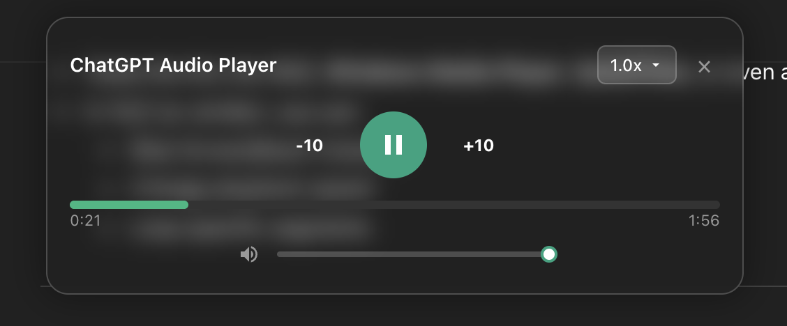

# ChatGPT Read Aloud with Controls Chrome Extension

A Chrome extension that enhances ChatGPT's read-aloud feature with a custom audio player providing advanced playback controls and seamless integration.



## 🌟 Key Features

### 🎵 **Advanced Audio Player**

- **Floating Interface**: Beautiful, non-intrusive player that appears at the top of the screen
- **Instant Loading**: Player appears immediately when read-aloud is clicked, with loading state
- **Smart State Management**: Completely resets between different audio sessions
- **Smooth Animations**: Fade-in/slide-down effects with professional polish

### ⏯️ **Comprehensive Playback Controls**

- **Play/Pause**: Large, prominent button with visual state changes
- **Skip Controls**: -10/+10 second buttons for precise navigation
- **Speed Control**: Hover dropdown with 0.25x–2.0x options
- **Progress Bar**: Click-to-seek with real-time position updates
- **Volume Control**: Native slider with mute toggle button
- **One-Click "Listen" Button**: Injected into every assistant message's action bar, so you don't have to open ChatGPT's "More actions" menu
- **Movable & Resizable Player**: Drag it by its header, resize it from the corner — position and size are remembered

### 🎯 **Intelligent Integration**

- **In-Page Audio Capture**: Observes the audio request ChatGPT's own page makes for read-aloud and plays it through the extension's player — no extra permissions needed
- **No Double Audio**: ChatGPT's own playback ends immediately while the extension's player takes over
- **Auto-Reset**: Completely resets player state when switching between different audio

### 🚀 **Smart Control Management**

- **Duration-Dependent Controls**: Skip buttons and speed controls are disabled until audio duration is available
- **Loading States**: Clear visual feedback during audio loading and streaming
- **Error Handling**: Graceful fallback when audio fails to load
- **Conversation Navigation**: Automatically closes player when navigating between conversations

## 🛠️ **Installation**

### From Chrome Web Store

1. Visit the [Chrome Web Store](https://chromewebstore.google.com/detail/chatgpt-read-aloud-with-controls/bgilonanhcpkjfeldiaalcnmilafljac)
2. Click "Add to Chrome"
3. Click "Add Extension" in the popup

### From Source

1. **Clone the repository**:

   ```bash
   git clone https://github.com/YossiSaadi/chatgpt-readaloud-with-controls-chrome-extension.git
   cd chatgpt-readaloud-with-controls-chrome-extension
   ```

2. **Install dependencies**:

   ```bash
   yarn install
   ```

3. **Build the extension**:

   ```bash
   yarn build
   ```

4. **Load in Chrome**:
   - Open Chrome and navigate to `chrome://extensions/`
   - Enable "Developer mode" (toggle in top-right)
   - Click "Load unpacked" and select the `dist` folder

## 🎮 **Usage Guide**

### Basic Usage

1. Navigate to [ChatGPT](https://chatgpt.com)
2. Find any assistant response with a read-aloud button (🔊)
3. Click the read-aloud button
4. The custom player appears immediately at the top-center of the screen
5. Use the enhanced controls for full audio management

### Player Controls

#### **Main Controls**

- **Play/Pause Button**: Central circular button (becomes rectangular when paused)
- **Skip Backward (-10)**: Rewinds 10 seconds
- **Skip Forward (+10)**: Fast forwards 10 seconds

#### **Speed Control**

- **Hover the speed button** (top-right) to see dropdown
- **Select from**: 1.0x, 1.25x, 1.5x, 1.75x, 2.0x
- **Visual feedback**: Checkmark indicates current selection

#### **Progress Control**

- **Click anywhere** on the progress bar to seek to that position
- **Real-time updates** show current playback position
- **Time display**: Shows current time / total duration

#### **Volume Control**

- **Volume button**: Click to toggle mute/unmute
- **Volume slider**: Drag or click to adjust volume level

#### **Close Control**

- **X button**: Stops audio and closes player
- **Always available**: Even when other controls are disabled

### Smart Features

#### **Immediate Response**

- Player appears instantly when you click read-aloud
- Initially disabled (grayed out) while audio loads
- Smoothly enables when audio is ready

#### **Duration-Dependent Controls**

- Skip buttons and speed control remain disabled until audio duration is available
- Prevents errors with streaming or loading audio
- Visual feedback shows when controls become available

#### **State Reset**

- Each new read-aloud click completely resets the player
- No leftover data from previous audio sessions
- Consistent, predictable behavior

## 🔧 **Development**

### Scripts

```bash
yarn dev          # Development build with watch mode
yarn build        # Production build
yarn clean        # Clean build directory
yarn lint         # Run ESLint
yarn type-check   # Run TypeScript type checking
```

### Project Structure

```
├── src/
│   ├── index.ts           # Content script: player UI, inline Listen button
│   └── interceptor.ts     # MAIN-world script: captures the read-aloud audio
├── public/
│   └── icons/            # Extension icons (16, 32, 48, 128px)
├── manifest.json         # Chrome extension manifest (V3)
├── package.json          # Dependencies and scripts
├── vite.config.ts        # Build configuration
├── tsconfig.json         # TypeScript configuration
└── README.md             # This file
```

### Architecture

#### **MAIN-World Interceptor (`src/interceptor.ts`)**

Runs in the page's MAIN world at `document_start` and patches `window.fetch`. When ChatGPT requests `/backend-api/synthesize` (its read-aloud audio), the interceptor:

- Buffers the real `audio/aac` response into a Blob and plays it through a hidden `<audio>` element the player UI controls
- Hands ChatGPT's own code a ~0.2s silent clip so its native playback ends immediately — no double audio, and ChatGPT's UI resets cleanly
- Notifies the content script via `window.postMessage` (request started / completed / failed)

This replaced the old `<audio>`-element hijacking (ChatGPT now decodes read-aloud with Web Audio, so there is no element to hijack) and the old `webRequest` background worker (no longer needed — the extension has no background script and no `webRequest` permission).

#### **Content Script (`src/index.ts`)**

- **ChatGPTReadAloudController**: Main class managing the entire player lifecycle
- **Player UI**: Creates and manages the floating, draggable, resizable player
- **Inline "Listen" Button**: Injects a one-click button into each assistant message's action bar (it drives ChatGPT's native Read Aloud menu item)
- **Audio Binding**: Binds playback controls to the interceptor's audio element
- **State Management**: Comprehensive state tracking, cleanup, and blob-URL lifecycle

#### **Key Classes and Methods**

**ChatGPTReadAloudController**:

- `constructor()`: Initializes observers and creates player UI
- `findAndBindInterceptedAudio()`: Locates the interceptor's audio element and binds to it
- `observeAssistantTurns()`: Injects the inline Listen button into new messages
- `resetToInitialState()`: Completely resets player between sessions
- `makePlayerDraggable()`/`makePlayerResizable()`: Window management with persisted geometry
- `showPlayer()`/`showPlayerDisabled()`: Controls player visibility and state

## 🎨 **Design Philosophy**

### **User Experience Principles**

- **Non-Intrusive**: Floating design doesn't interfere with ChatGPT's interface
- **Predictable**: Consistent behavior across all audio sessions
- **Responsive**: Immediate feedback for all user interactions
- **Professional**: Polished animations and visual design

### **Technical Excellence**

- **Performance**: Efficient DOM manipulation and event handling
- **Reliability**: Robust error handling and state management
- **Compatibility**: Works across different ChatGPT interface updates
- **Maintainability**: Clean, well-documented TypeScript codebase

## 🔒 **Privacy & Security**

### **How Does the Extension Capture the Audio? (No Extra Permissions)**

The extension holds **no API permissions at all** — only host access to `chatgpt.com`. Audio is captured entirely inside the ChatGPT tab: a small script observes the request ChatGPT's own page makes to `https://chatgpt.com/backend-api/synthesize` (its read-aloud audio), buffers that audio locally, and plays it through the extension's player. ChatGPT's own playback is replaced with a fraction of a second of silence so you never hear two copies at once.

**What it does NOT do:**

- ❌ **Does not read or store conversation content**
- ❌ **Does not access authentication tokens or login data**
- ❌ **Does not modify or intercept any other ChatGPT requests** (only requests whose path is exactly `/backend-api/synthesize`, and only when they return audio)
- ❌ **Does not send any data to external servers**
- ❌ **Does not track or monitor your browsing**

### **Security Guarantees**

- **No Data Collection**: Extension doesn't collect any personal data; the only thing it stores is the player's on-screen position/size in your browser's `localStorage` (numbers only, never leaves your browser)
- **Local Processing**: All audio capture and control happens locally in your browser tab
- **Minimal Permissions**: No background worker, no `webRequest`, no `storage`, no `tabs` — only chatgpt.com host access
- **Open Source**: Code is fully auditable - you can verify exactly what it does
- **No External Communication**: Extension never sends data outside your browser

### **Why Does This Extension Need Host Permission for ChatGPT.com?**

This extension requests host permission for `https://chatgpt.com/*` to enable its core functionality of enhancing ChatGPT's read-aloud feature.

**Here's exactly what it does:**

- **Injects the custom audio player** into ChatGPT pages to provide enhanced controls
- **Monitors for read-aloud button clicks** to know when to activate the player
- **Accesses ChatGPT's audio elements** to provide seamless playback control
- **Manages ChatGPT's native stop button** to prevent conflicts during custom playback

**What it does NOT do:**

- ❌ **Does not access or read your ChatGPT conversations**
- ❌ **Does not modify your messages or ChatGPT's responses**
- ❌ **Does not access authentication tokens or account information**
- ❌ **Does not work on any other websites**
- ❌ **Does not send any data to external servers**

**Why is this permission necessary?**

Chrome extensions require explicit host permissions to:

- Inject content scripts into web pages
- Access DOM elements (like audio players and buttons)
- Modify page appearance (showing the floating player)
- Listen for user interactions on specific websites

Without this permission, the extension couldn't run on ChatGPT at all.

**Scope Limitation:**
The permission is strictly limited to `chatgpt.com` - the extension has no access to any other websites you visit.

## 🐛 **Troubleshooting**

### Common Issues

**Player doesn't appear**:

- Refresh the ChatGPT page
- Check that the extension is enabled in Chrome
- Ensure you're on `chatgpt.com`

**Audio doesn't play**:

- Check your browser's audio permissions
- Ensure ChatGPT's audio would normally work
- Try refreshing and clicking read-aloud again

**Controls are disabled**:

- Wait for audio to finish loading (duration will show)
- Some audio streams take longer to provide duration
- Try a different ChatGPT response

## 📝 **Changelog**

### v2.0.0 (Latest)

- ✨ Enhanced user interface and improved controls
- ⚡ Smart control management (duration-dependent enabling)
- 🎨 Enhanced UI with better animations and feedback
- 🔄 Complete state reset between audio sessions
- 📱 Improved responsive design

### v1.0.0

- 🎵 Initial release with basic audio player
- ⏯️ Play/pause, seek, and volume controls
- 🎯 ChatGPT integration and button management

## 🤝 **Contributing**

We welcome contributions!

### Development Setup

1. Fork the repository
2. Create a feature branch: `git checkout -b feature/amazing-feature`
3. Make your changes and test thoroughly
4. Commit with descriptive messages
5. Push to your branch and create a Pull Request

### Code Standards

- **TypeScript**: Strict typing required
- **ESLint**: Follow the configured rules
- **Prettier**: Code formatting is enforced

## 📄 **License**

MIT License - see [LICENSE](LICENSE) file for details.

## 🙏 **Acknowledgments**

- **ChatGPT Team**: For providing the read-aloud API that makes this possible

- **Chrome Extensions Team**: For the powerful extension APIs

## 📞 **Support**

- **Issues**: [GitHub Issues](https://github.com/YossiSaadi/chatgpt-readaloud-with-controls-chrome-extension/issues)
- **Feature Requests**: Use GitHub Issues with the "enhancement" label
- **Questions**: Start a GitHub Discussion
